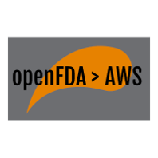

# openFDA AWS data pipeline
> Enabling advanced analytics of openFDA data in AWS

This data pipeline leverages the power of AWS to:
* Automate the extraction of bulk data from the openFDA website
* Loads the raw data into an S3 data lake
* Transforms the date with custom options for filtered fields and enrichment with NLP models to a curated (clean) S3 bucket
* Loads the data into Elasticsearch for advanced full text search and visualizations
* Enables other analytics to be executed on the data using AWS Glue, EMR, or other AWS analytics

An architecture overview:


## Getting started

The plan is to make the entire build automated using a CloudFormation or serverless template.  The current setup is a little manual.  See [building](#Building) for instructions.

### Initial Configuration

This project uses Python 3.8.  Testing the functions locally is possible using the AWS CLI (https://docs.aws.amazon.com/cli/).

## Developing

Clone the repository:

```shell
git clone https://github.com/prescode/open-fda-data-pipeline.git
```

Navigate to the function you want to change:

```shell
cd transform
```

Create a new virtual Python environment:

```shell
python3 -m venv .venv
```

Use pip to install the function's current dependencies into the virtual environment:

```shell
pip install -r ./requirements.txt -t
```

Activate your virtual environment:

```shell
source .venv/bin/activate
```

Start the Python shell:
```shell
python
```

Then test your code changes by entering function definitions, variable assignments, and other code into the python shell.  Test events can be created using the included json files to simulate S3 put events.

Add new dependencies to the requirements file (after installing them into your virtual environment using `pip install`)

```shell
pip freeze > requirements.txt
```

After making (and testing) your code changes close the python shell and deactivate the virtual environment:

```shell
deactivate
```

Remove your virtual environment (a build script will be used to create a new one for deployment):
```shell
rm -r .venv
```

### Building

Each function is built separately.  A `setup.sh` file is included in each folder.

```shell
./setup.sh
```
The shell script will create a virtual python environment, install all the necessary dependencies, then package the dependencies along with the function python file and create a `package.zip` file ready to be deployed to AWS Lambda.  The virtual environment and setup directory will be cleaned up after the process is complete.

### Deploying / Publishing

See ./prerequisite_aws_setup.txt for more details.

1. Create S3 buckets for:
   1. urls
   2. raw data
   3. clean data
2. Create Elasticsearch domain
3. For each function 
   1. Create Lambda functions via CLI or console
   2. Create Lambda IAM role with permissions to write to S3 bucket (and Elasticsearch for "load" function)
   3. Upload `package.zip` from build folder
   4. Update handler name to match name of python file (e.g. `load.lambda_handler`)
   5. Add environment variables defined in the python file
   6. Set environment variables
   7. Update basic settings: memory and timeout
   8. Add trigger as S3 put from configured S3 bucket (except for url-search)
4. Create empty test event in url-search lambda and trigger it manually using the "Test" button

## Features

* Clean and transform FDA dataset specifically for your use case
* Use the power of AWS Analytics to gain insights on the FDA datasets
* Join FDA data with other datasets for advanced analytics

## Configuration

Filtered data fields can be configured in the "transform" function's list of filtered fields variable (Elasticsearch index mapping may also need to be changed).

## Contributing

If you'd like to contribute, please fork the repository and use a feature
branch. Pull requests are much appreciated.

## Links

- Repository: https://github.com/prescode/open-fda-data-pipeline/
- Issue tracker: https://github.com/prescode/open-fda-data-pipeline/issues
- openFDA website: https://open.fda.gov/
- AWS Elasticsearch: https://aws.amazon.com/elasticsearch-service/
- Related projects:
  - openFDA: https://github.com/FDA/openfda/
- Diagram authoring: https://draw.io

## Licensing

&copy; Dean Johnson - The code in this project is licensed under MIT license.
